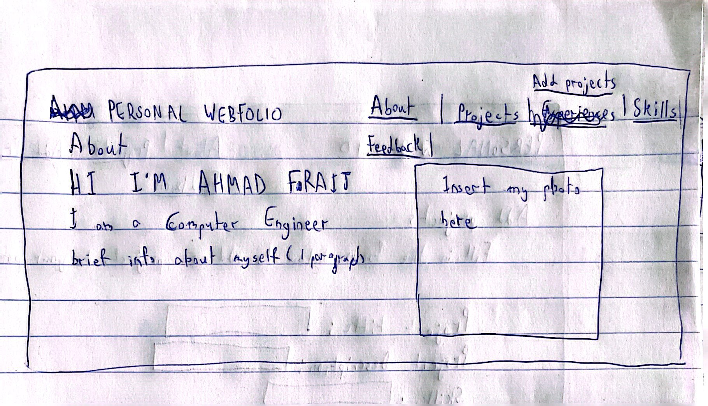
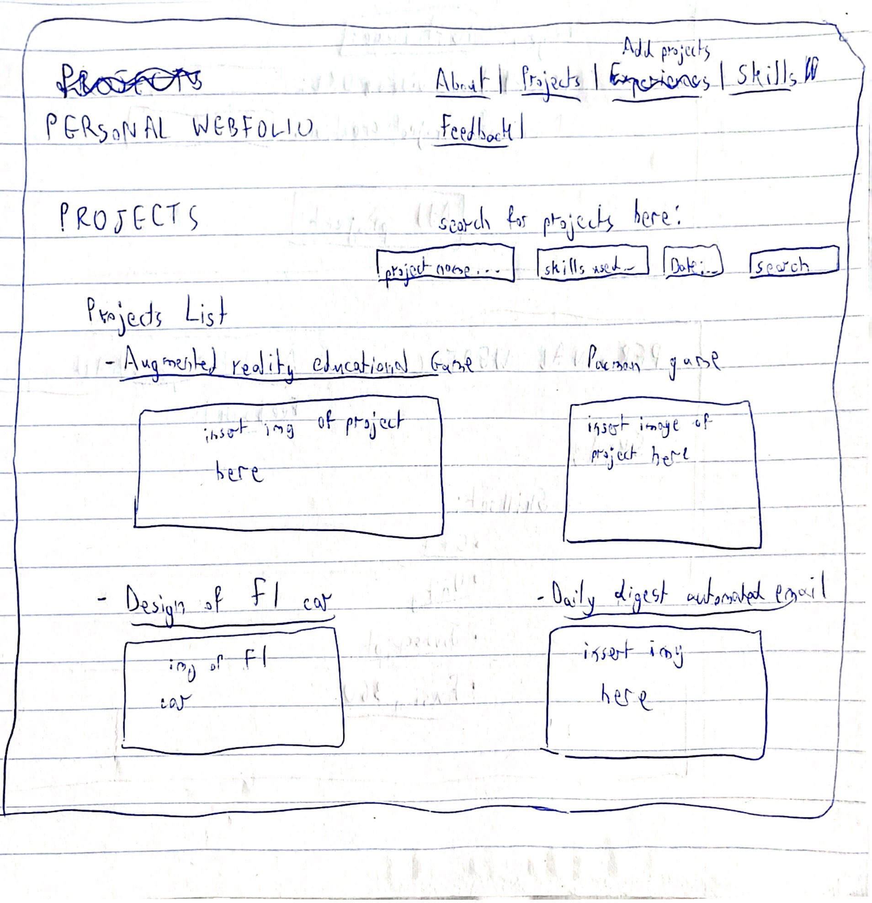
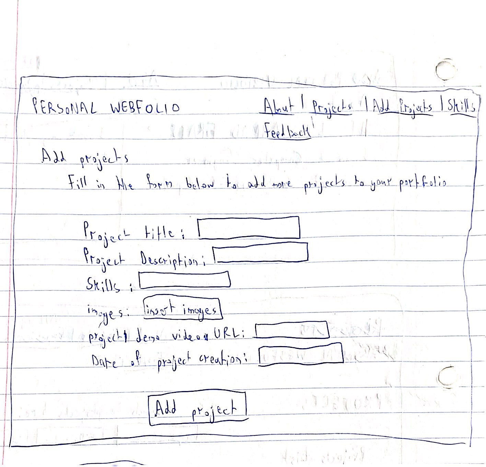
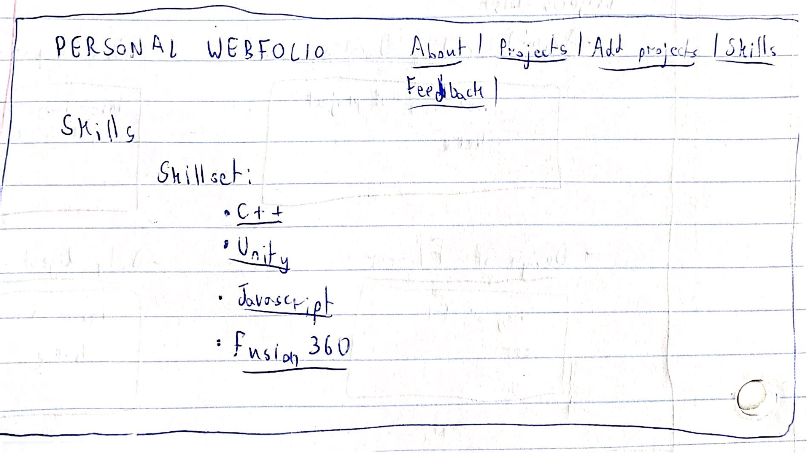
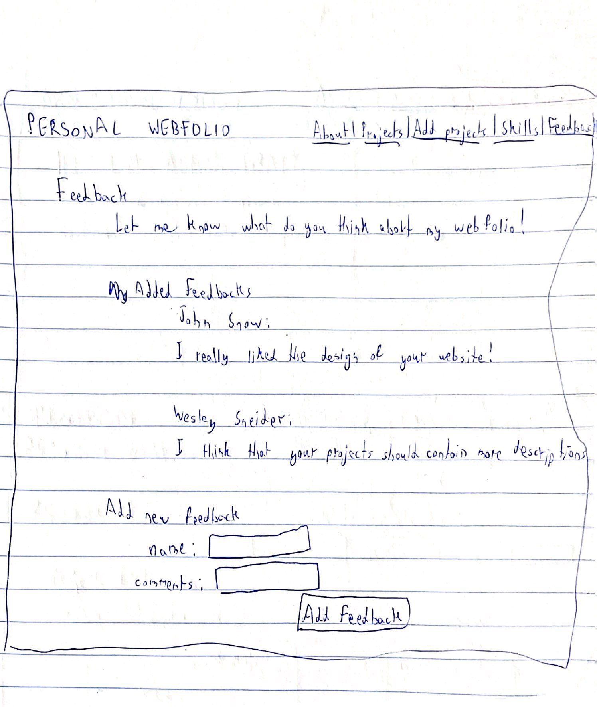
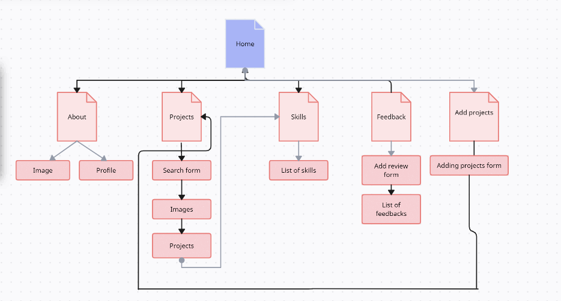

# My Personal Webfolio 

## Overview


Summarizing all of my experiences and displaying my skills in a one page resume paper can sometimes be quite difficult.

My Personal Webfolio is an online portfolio website that will allow me to discuss and display in more details my professional and academic experiences with the aid of some pictures, videos and amazing designs. This portfolio will be an effective way to stand out in competitive job market and prove to potential customers my success in web development.


## Data Model

The application will store data related to projects, users and skills

* Projects 
* People can register for accounts on my website to add feedback, and there will be one admin who has access to all pages


An Example Project document:

```javascript
{
  projectTitle: "Designing Augmented reality educational game",
  projectDescription: "Developed Android educational game by displaying multiple-choice mathematical questions on screen",
  projectDemoURL: //insert project demo url here,
  createdDate: "December 2020"
}
```

An Example Feedback document:

```javascript
{
  reviewerName: "Ahmad",
  reviewerFeedback: "I like the theme of your website",
}
```

An Example User document with referenced project documents:

```javascript
{
  username: "admin",
  password: "//it will be hashed with salt in the document",
}
```


## [Link to Commented Schema](db.mjs) 


## Wireframes


/about - page for showing my general information in the about page of my portfolio



/projects - page for displaying the projects in the projects page of my portfolio



/addProjects - page for adding new projects to my projects list



/skills - page for displaying my skills



/feedback- Page for displaying added feedbacks on portfolio and add new feedback




## Site map




## User Stories or Use Cases

1. as a user I can view general information about Ahmad Fraij
2. as a user, I can view all of the projects that Ahmad Fraij has created
3. as a user, I can filter the projects done by Ahmad and view certain ones only based on skills used in these projects
4. as a user, I can view all of the skills that Ahmad possess
5. as a user, I can view all feedbacks given to Ahmad 
6. as a user, I can add feedback to Ahmad in the feedback section
7. as a user, I cannot add new projects to the project list
8. As Ahmad Fraij(admin), I can add new projects to my project list

## Research Topics

  

* (4 points) Use passport.js library for user authentication and session management
    *It will provide an easy to use API that can authenticate users
    * Provide middleware that allows application to serialize and deserialize user objects to and from session storage.
    *Keep track of authenticated users and allows easy implementation of logout
    *It helps in ensuring that only authenticated users can access certain pages like /addProjects
    
    
* (4 points) Bootstrap + Sass
    * Add css styling using bootstrap
    *modify the bootstrap default library by including data in a sass file
    * compile the sass file into a css file
    
* (2 points) Use github REST API
  *This API allows developers to read and write data from github repositiories.
  *I want to use it to be able to display my github repositories on my personal portfolio website
  *I can use Octokit.js javascript client  API or I can used fetch method in javascript.


10 points total out of 10 required points 

## [Link to Initial Main Project File](app.mjs) 


## Annotations / References Used

1. Based on the research topic, github API I will look into this tutorial over here https://github.com/jamisoncozart/Using-the-GitHub-API-Tutorial
2. For the sitemap I used this website: https://creately.com/diagram/example/go438cyo3/personal-page-sitemap-site-map
3.For the passport library implementation I referred to this documentation: https://www.passportjs.org/docs/
4.For the use of bootstrap and sass I referred to this website: https://getbootstrap.com/docs/5.3/getting-started/introduction/


